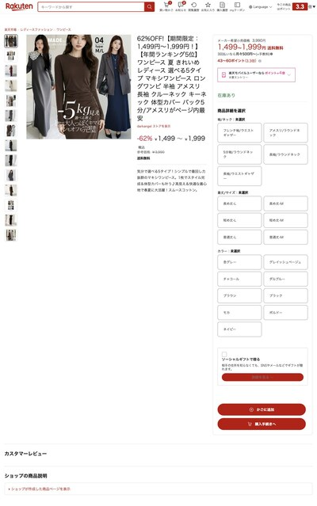

# Sukkiri（すっきり）

**A Chrome extension that makes 楽天市場 readable.**

Rakuten product pages bury the price and the cart button under thousands of
pixels of shop banners. Sukkiri rebuilds the page so the things you actually
need — photos, price, delivery, buy button — are at the top, in one screen.

## One product page, before and after

Both columns below are the same page, uncut, at the same scale.

<table>
  <tr>
    <th align="left" width="50%">Before &mdash; 121,273px to reach the cart</th>
    <th align="left" width="50%">After &mdash; 2,033px</th>
  </tr>
  <tr valign="top">
    <td width="50%">
      
    </td>
    <td width="50%">
      
    </td>
  </tr>
</table>

Keep scrolling the left column. That is one product page, and the cart button
is at the bottom of it &mdash; **121,273 pixels down**, roughly 143 screens.
The right column is the same product after Sukkiri: **2,033 pixels**, about
60&times; shorter.

### The first screen

Before &mdash; the product you clicked on is not on this screen.

After &mdash; photos, price, points, stock and the buy box, all above the fold.

---

## What it changes

**Product pages**

- The buy box moves to the top. On the page above, the cart form sat at
  **121,273px** and now sits at **408px**.
- Photos come from Rakuten's own product gallery, not the shop's banner art.
- Points, instalments and 定期購入 (subscription) stay exactly where you can see
  them, because they're moved, not recreated.
- Reviews get a star breakdown and readable cards.
- The shop's original page isn't thrown away — it's folded under
  「ショップの商品説明」 if you want the seller's full pitch.

**Search and category pages**

- Titles in plain black instead of every result shouting in red.
- Bigger cards, bigger photos, three per row.
- The delivery estimate promoted — it's the thing you're actually comparing.
- Sponsored results hidden.

**Rakuten's own header is left completely alone.**

---

## Install

Chrome Web Store submission in progress. Until it lands, load unpacked:

1. Download this repo (**Code → Download ZIP**, then unzip) or `git clone` it
2. Go to `chrome://extensions`
3. Turn on **Developer mode** (top right)
4. Click **Load unpacked** and pick the folder

Open any Rakuten product page and it works.

## Turning it off

**Click the toolbar icon.** The badge shows `OFF` and the page reloads exactly
as Rakuten made it. Click again to turn it back on.

This matters more than for a normal theme. Sukkiri *moves* the real cart form
into its new layout rather than copying it, so your quantity, variant choice and
login session keep working. But it also means a shop with unusual page code
could confuse it — so there is always a one-click way back.

If something does go wrong mid-rebuild, Sukkiri detects it and restores
Rakuten's original page by itself, rather than leaving you on a broken one.

---

## Honest limitations

Worth knowing before you install:

- **Tested on 12 shops.** Rakuten has roughly 50,000, and every one writes its
  own product-page HTML. Yours might be one it hasn't seen.
- **Checkout has been completed once, on one shop.** That's the test that
  matters most, and it passed — but it is one data point, not coverage.
- **A Rakuten redesign will break it,** all at once, for everyone. This is a
  personal project, not a maintained product.
- **Sponsored results are hidden** on search pages.
- Desktop Chrome only.

Being on the Web Store is a support promise — a Rakuten redesign breaks it for
everyone at once, and there is no telemetry to warn you. Bear that in mind
before relying on it.

---

## How it works

For the curious (and for me in six months)

Rakuten item pages have no shared layout — every shop hand-writes its own HTML —
so there's nothing stable to style. What *is* stable is the data Rakuten injects
into every shop page:

| anchor | gives |
|---|---|
| `meta[itemprop=image]` | the real product gallery, not the shop's banners |
| `meta[itemprop=name]` | product name |
| `#itemPrice` / `meta[itemprop=price]` | price, ranges, list price |
| `#offers` | points, instalments, 定期購入 chooser |
| `#js-review-widget` | rating and reviews |
| `table.normal-reserve-form` | the live cart form |
| `ld+json BreadcrumbList` | category path |

`content.js` reads those and builds a fresh page from them.

**The cart is moved, not cloned.** `appendChild` relocates the live node, so
Rakuten's own event listeners, SKU logic and CSRF state survive and the item
stays purchasable. Because that detaches the only way to buy, the whole render
is wrapped: an anchor comment marks where the cart was, a `try/catch` puts it
back, and a post-flight check asserts the cart is present *and* visible —
anything unexpected restores Rakuten's page.

**The star histogram is fetched by the service worker,** not the content script.
Under Manifest V3 a content script's `fetch` is subject to the *page's* CORS, so
item.rakuten.co.jp cannot read review.rakuten.co.jp no matter what
`host_permissions` says. The bars only render if the fetched counts reconcile
with the rating already on the page — a wrong distribution is worse than none.

**Off is genuinely off.** Every CSS rule is scoped to `.rz-item` / `.rz-search`,
and those classes are only added when enabled — so disabling applies no
stylesheet and runs no rebuild, rather than undoing one.

Selectors use `[class*="prefix--"]` because Rakuten's class names carry build
hashes (`title-link--3Yuev`). That survives a rebuild; it won't survive a
redesign.

---

## Privacy

Collects nothing, sends nothing, has no analytics. The only network request it
makes is to `review.rakuten.co.jp`, to read the star breakdown for the product
page you're already looking at.

## License

MIT — see [LICENSE](LICENSE).

---

*Independent project. Not affiliated with, endorsed by, or connected to Rakuten
or Amazon. "Rakuten" and "楽天市場" are trademarks of Rakuten Group, Inc.,
used here only to say which site this works on.*
